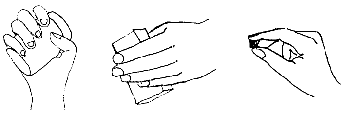

A Simple Set of Grasps for a Dextrous Hand
******************************************

* **Author:** Damian Lyons
* **Source:** IEEE International Conference on Robotics and Automation, 1985

Summary
=======
For our purposes, this paper presents a grasp index classification table, which divides grasps based on firmness, precision and object characteristics. 
It also argues that a distributed computational model is needed in order to provide a control system good enough to compare with humans and animals. A partial
implementation of this distributed system is presented (although not in deep detail, I would like to see what was the final result).

Problem Domain
==============
The grasping process involves 3 defined stages:

* Reach
* Grasp
* Manipulation

these stages are not necessarily differentiated at all times. A few observations regarding these:

1. The *reach* and *grasp* movements occur in parallel: The hand preshapes for the grasp *while* the reach is in progress.
2. The *reach* is concerned with the object position.
3. The *grasp* is concerned with the object characteristics (e.g. shape, size and orientation)
4. The *grasp* is also concerned with intended object usage (task-specific).

Grasp Abstraction
=================
The authors propose an abstract definition for *grasps*. A *grasp* is
then a hand configuration which relates finger positions and movements
to perform a particular task. 

Given a task, a suitable grasp can be chosen on the basis of:

1. The characteristics of the object to be grasped (geometry, size, dynamic characteristics)
2. The actions to be performed with the object (task-dependent)

A grasp entails:

1. A preshape finger configuration (not strictly defined, 
   it varies according to the object)
2. DOFs of the hand once the object has been grasped (how much can the object manipulate
   the object once it is grasped)

Grasp Types
===========
In order for grasps to be selected, they must be categorized. This categorization can be made based on
observation of robotic grasping in industrial environments; however, most of these grasps are performed
by two-fingered grippers, which provide far less functinoalities than human-like hands. Hence, this paper
defines a grasp classification based on literature on *human grasping*.

There are 2 standard indices to categorize grasps (I think these are the Napier's ones):

1. Power or firmness required in the grasp (i.e. to carry a heavy object firmly to avoid all possibility of slippage).
2. Precision required in the grasp (i.e. to rotate a nut).

Using these 2 indices, the authors define 3 different configurations for a dexterous hand:

1. **Encompass Grasp:**
   Mostly used to get a power grasp. In this grasp, the hand (generally) tightly envelopes the object to be grasped. Given this,
   manipulation can be done only by using the DOF of the arm + wrist (since the fingers are fixedly wrapping the object)

2. **Lateral Grasp:**
   Also called a *pinch grasp*. This grasp requires the fingers and thumb to face each other (in a manner similar to a gripper).
   The flat surface of the fingers (not the fingertips) are used to grip the object. This type of grasp is more often used to grasp
   flat objects.

3. **Precision Grasp:**
   The grasped object is held between the fingertips. Rotation and translation can be obtained by moving the fingers only, without
   need of moving the arm or the wrist.

   
   From left to right: Encompass grasp, lateral grasp and precision grasp
	   
Grasp Index
===========
Once the 3 general grasp types have been defined, we need to define *when* to use them, meaning, for which tasks each of these grasps
is appropriate. Lyons et al proposed a general *grasp index* table to map task + object requirements to the grasp type required. 

* For functionality, they divided the tasks in 4 groups, based on the (1) firmness and (2) precision required for the task. 
* For object requirements, they used two main criteria: Size (small, long and large) and Shape (flat and round).

More details in the table below:

   
   Grasp Index table (P, NP, F and NF stand for Precision, no Precision, Firmness and No firmness required in the grasp task)

