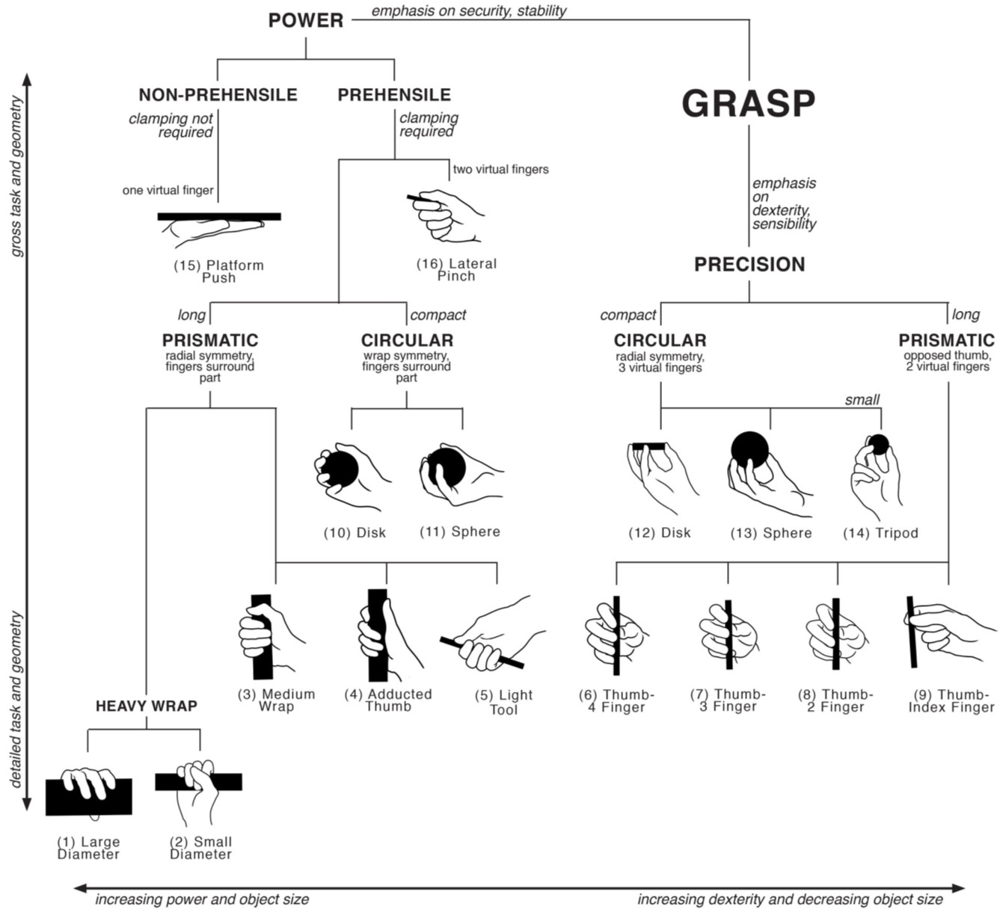

The Origins of Grasp Classification
***********************************

* **Paper title:** On Grasp Choice, Grasp Models, and the Design of Hands for Manufacturing Tasks
* **Author:** Mark Cutkosky
* **Source:** IEEE Transactions on Robotics and Automation, Vol 5, Number 3, June 1989

Summary
=======
This paper presents a grasp taxonomy based on the observation of how machinists performed small-batch machining operations. This paper's motivation is to elaborate a taxonomy that facilitates the design of robotic hands based on common machining tasks. 

Describing a Grasp
==================

Humans need to grasp objects in order to manipulate them. Depending on the task, different grasp configurations can be adopted by the hand. Manipulation is a complex activity in which many factors intervene, hence modelling it can be increasingly complex. Because of this, many simplifying assumptions have been done by researchers in the area. Here a few simplifying assumptions commonly found:

* Rigid-body models with point contacts: Consider that the finger and the object only have one touching point
* Linearized kinematics: Not sure what this means
* Quasi-static analysis: No inertial or viscous terms. I.e. Coulomb friction model for the fingers
* No sliding or rolling in the fingertips
* Simplified object representation: Convex, rigid primitives, polyhedra

Quality measurements
--------------------
In order to compare different grasps on an object, metrics are needed. Depending on the task to be performed, different criteria can be evaluated. Cutkosky present 15 general measures found in the literature at that time. Here a few of them:

1. **Compliance:** Opposite of stiffness. 
2. **Connnectivity:** How many degrees of freedom are there between the grasped object and the hand?
3. **Force closure:** Is the object unable to move without slipping when the finger joints are locked and external forces are applied?
4. **Form closure:** Can external forces and moments be applied from any direction without moving the object when the fingers are locked?
5. **Grasp isotropy:** How well can we apply forces and moments to the object? (Jacobian related)
6. **Internal forces:** How much force do you need to keep the object?
7. **Manipulability**
8. **Resistance to slipping**
9. **Stability:** Will the grasp return to its initial configuration after being disturbed by an external force or moment?

Grasp Taxonomy
==============

Napier suggested 2 general type of grasps. Let's start with them:

1. **Power grasps:** 
   Used on tasks where stability and security are highly important. Power grasps entail large areas of contact between the grasped object and the surface of the fingers and palm. 
2. **Precision graps:**
   Used on tasks where sensitivity and dexterity are needed. In this type of grasp, the object is normally held with the tips of the fingers and thumb.

Starting from these, a tree-like taxonomy is suggested with 16 different types of grasp as shown below (original image from *An Investigation of Grasp Type and Frequency in Daily Household and Machine Shop Tasks*, Zheng et al, ICRA 2011)

